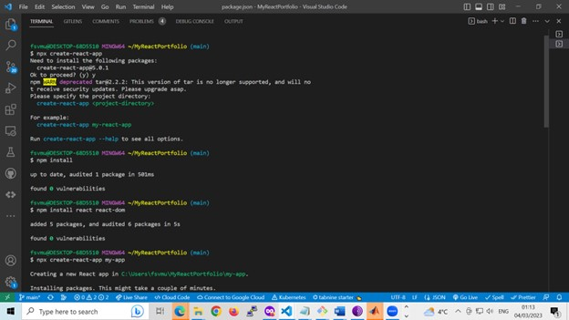

# React Portfolio App

This is a portfolio website built with React. The website is designed to showcase my skills, experience, and projects.

## Design

The website design is mobile-first and uses a custom color palette to create a unique and professional look. The font size is chosen to ensure readability and reduce eye strain.

## Base Requirements

The website is built using React and features dynamic rendering with React Router for seamless navigation. The website includes the following information:

- Name
- Links to GitHub profile, LinkedIn page, and email address
- Phone number (optional)
- PDF version of my CV with up-to-date projects and professional experience
- List of projects with titles, links to the deployed version, links to the GitHub repository, and a GIF or screenshot of the deployed application.

## Components

The website features the following components:

- App: The top-level component that renders all necessary child components
- Header: Renders across every page component of the site and contains a Navbar
- Home page: A welcome landing page that includes my name, a headshot, my brand statement, and an indication that this is my portfolio site
- Projects page: Renders six instances of the Project component dynamically, utilizing a JSON file for project details data

- Project: A reusable component that renders a single instance for each project, ingesting JSON data as props and utilizing Router props to properly render the right project based on user selection
- Contact page: Includes contact information, a contact form for handling events, and links to my email address, GitHub profile, and LinkedIn page, as well as a link to a PDF version of my CV.

## Getting Started

To get started with this project:

1. Clone this repository to your local machine using `https://github.com/YOUR_USERNAME/YOUR_PROJECT_NAME.git`
2. Install the necessary dependencies by running `npm install`
3. Start the development server by running `npm start`
4. Open `http://localhost:3000` in your web browser to view the website.

## Contributing

Contributions are welcome! Please fork this repository and submit a pull request with any changes you'd like to make.

## License

This project is licensed under the MIT License - see the LICENSE.md file for details.
